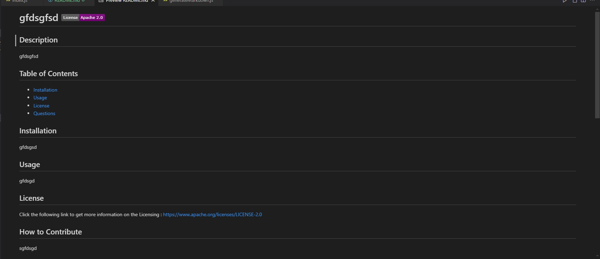

# Read Me Creator
## Description
This project was undertaken as part of a coding bootcamp. The goal of this project was to create a program that uses the terminal to ask questions and have the user answer them to create a read me file. It also required the user to have a selection of license options and create a bade and description with a link based on which license type was chosen.

## Installation
If you wish to run this project locally on your own computer, assuming you have git installed, input the following code in your terminal.
git clone https://github.com/philcurtis4/create_readme_9
## Usage

Here is a screenshot of the finished readme after running the program.

    
## Credits
This program was created by Phil Curtis with the knowledge gained from the rutgers bootcamp.
## License
This project has a MIT License. 